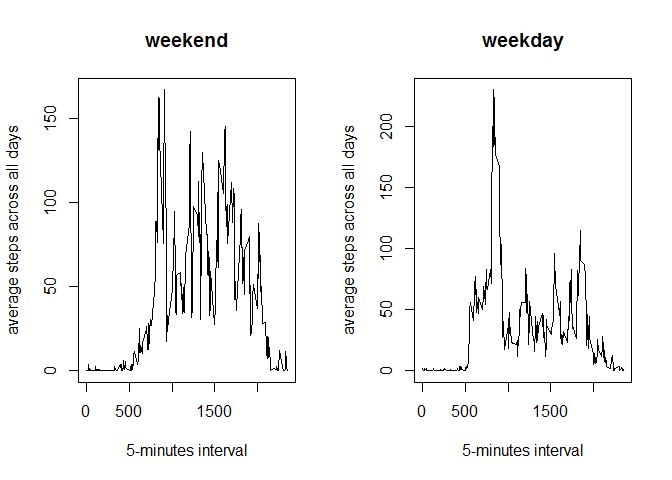

## Loading and preprocessing the data

```r
rm(list=ls()) # permet de liberer la memoire
data = read.csv("activity.csv", sep = ",", header = T)
```


## What is mean total number of steps taken per day?

```r
library(doBy)
```

```
## Warning: As of rlang 0.4.0, dplyr must be at least version 0.8.0.
## x dplyr 0.7.8 is too old for rlang 0.4.1.
## i Please update dplyr to the latest version.
## i Updating packages on Windows requires precautions:
##   <https://github.com/jennybc/what-they-forgot/issues/62>
```

```r
hist(data$steps)
```

<!-- -->

```r
#compute de total number of steps taken per day
aux = summaryBy(steps ~ date, data, FUN = sum)

#the  mean
mean(aux$steps.sum, na.rm = T)
```

```
## [1] 10766.19
```

```r
#the  median
median(aux$steps.sum, na.rm = T)
```

```
## [1] 10765
```


## What is the average daily activity pattern?

```r
#compute de average number of steps taken across all days
aux = summaryBy(steps ~ interval, data, FUN = mean, na.rm = T)

plot(x = aux$interval, y = aux$steps.mean, type = "l", xlab = "5-minutes interval", ylab = "average steps across all days")
```

<!-- -->

```r
#which 5-minutes interval contain de maximum number of step
aux = summaryBy(steps ~ interval, data, FUN = max, na.rm = T)
#The result
aux$interval[which(aux$steps.max == max(aux$steps.max))]
```

```
## [1] 615
```


## Imputing missing values

```r
#Calculate and report the total number of missing values in the dataset
dim(data[which(is.na(data$steps)), ])[1]
```

```
## [1] 2304
```

```r
#Devise a strategy for filling in all of the missing values in the dataset

#compute de average number of steps taken across all days
aux = summaryBy(steps ~ interval, data, FUN = mean, na.rm = T)

result_data = data

for(i in 1:nrow(result_data)){
  if(is.na(result_data$steps[i])){
    result_data$steps[i] = aux$steps.mean[which(aux$interval == result_data$interval[i])]
  }
}

#Make a histogram of the total number of steps taken each day
hist(result_data$steps)
```

<!-- -->

```r
#compute de total number of steps taken per day
aux = summaryBy(steps ~ date, result_data, FUN = sum)

#the  mean
mean(aux$steps.sum, na.rm = T)
```

```
## [1] 10766.19
```

```r
#the  median
median(aux$steps.sum, na.rm = T)
```

```
## [1] 10766.19
```

```r
#Do these values differ from the estimates from the first part of the assignment?
#Answer : No, this values not differ from the first part of assignment

#What is the impact of imputing missing data on the estimates of the total daily number of steps ?
#Answer : the impact is negligible
```


## Are there differences in activity patterns between weekdays and weekends?

```r
#Create a new factor variable in the dataset with two levels - "weekday" and "weekend"
result_data$day_label = NA
result_data$day_label[which(!(weekdays(as.Date(result_data$date)) %in% c("samedi", "dimanche")))] = "weekday"

result_data$day_label[which(weekdays(as.Date(result_data$date)) %in% c("samedi", "dimanche"))] = "weekend"

result_data$day_label = as.factor(result_data$day_label)

#Make a panel plot containing a time series plot (i.e. type = "l") of the 5-minute interval
library(ggplot2)
```

```
## Warning: package 'ggplot2' was built under R version 3.5.2
```

```r
par(mfrow = c(1,2))

#compute de average number of steps taken across all days
aux = summaryBy(steps ~ interval + day_label, result_data, FUN = mean, na.rm = T)

plot(x = aux$interval[which(aux$day_label == "weekend")], y = aux$steps.mean[which(aux$day_label == "weekend")], type = "l", xlab = "5-minutes interval", ylab = "average steps across all days")
title("weekend")


plot(x = aux$interval[which(aux$day_label == "weekday")], y = aux$steps.mean[which(aux$day_label == "weekday")], type = "l", xlab = "5-minutes interval", ylab = "average steps across all days")
title("weekday")
```

<!-- -->

